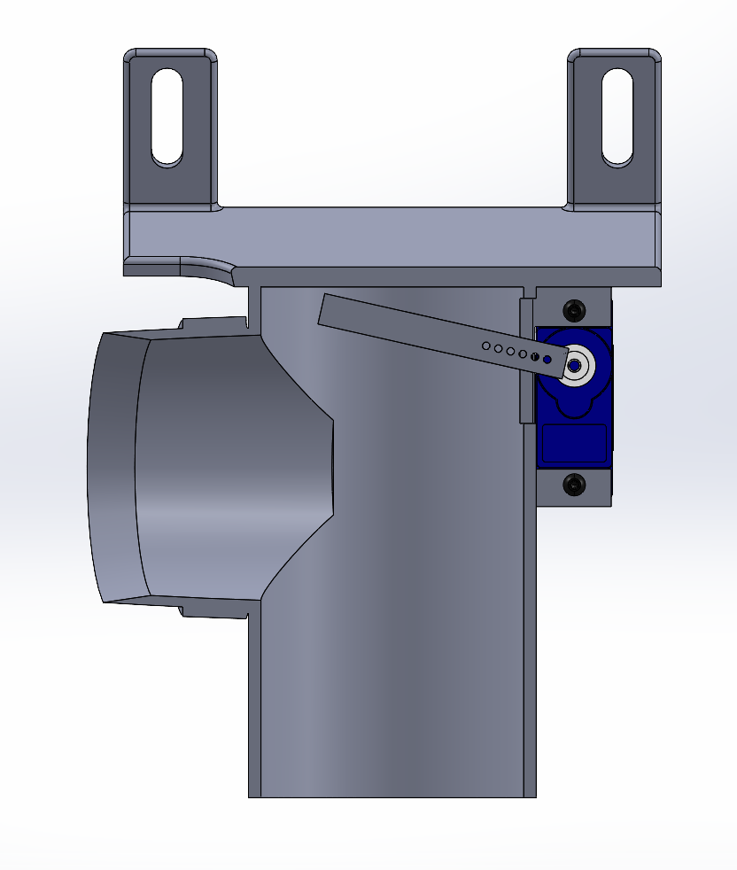
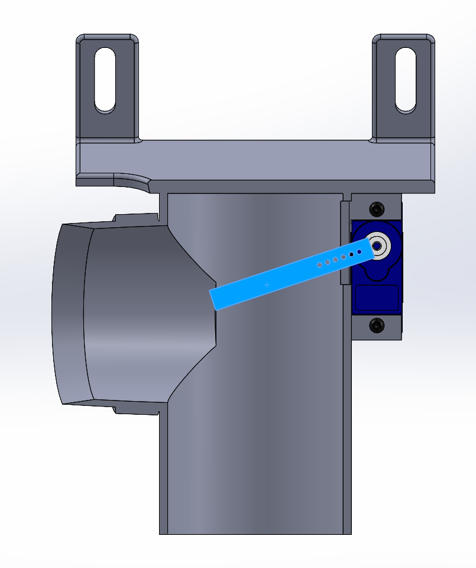
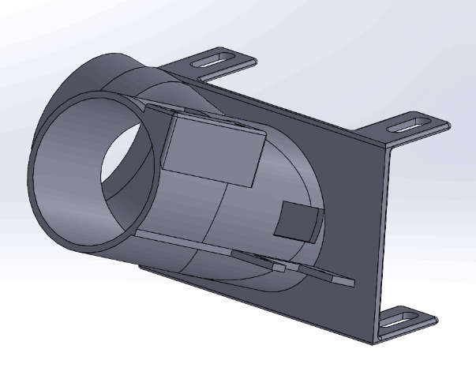
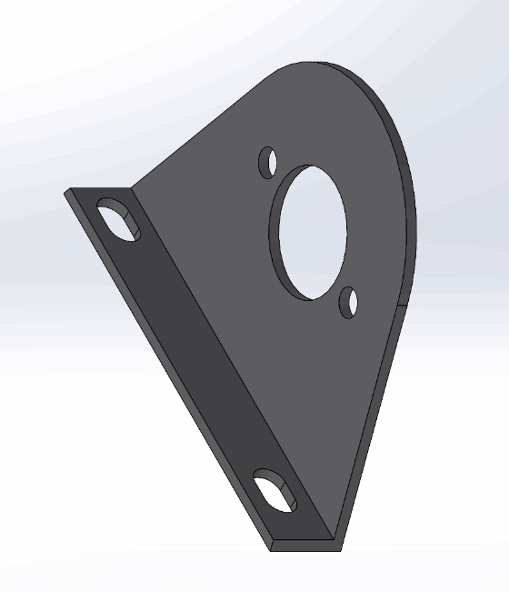
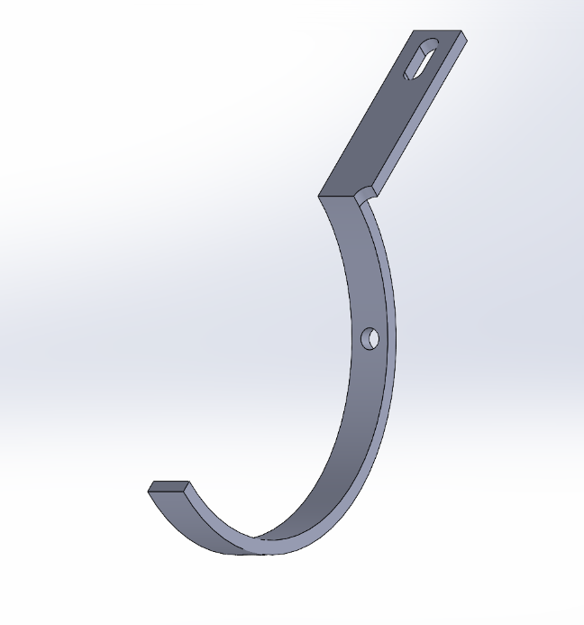
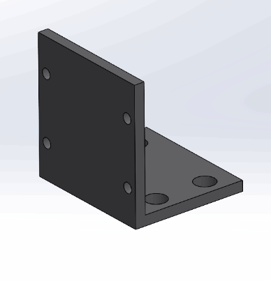
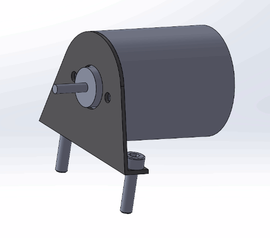
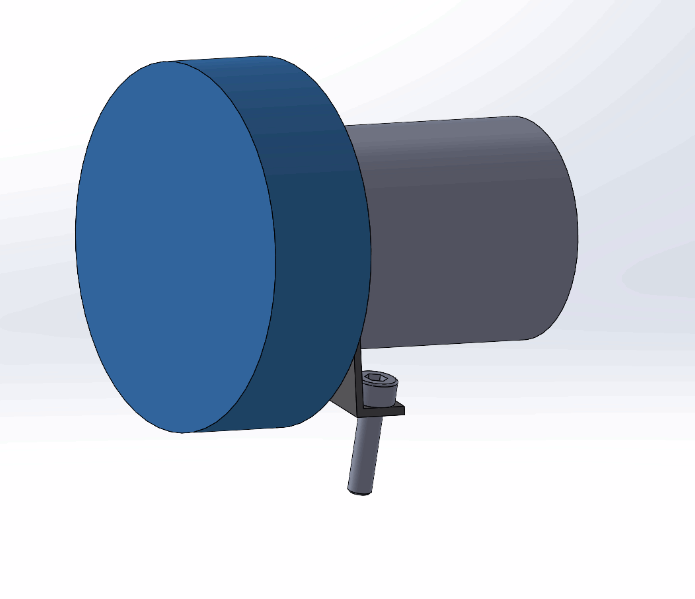
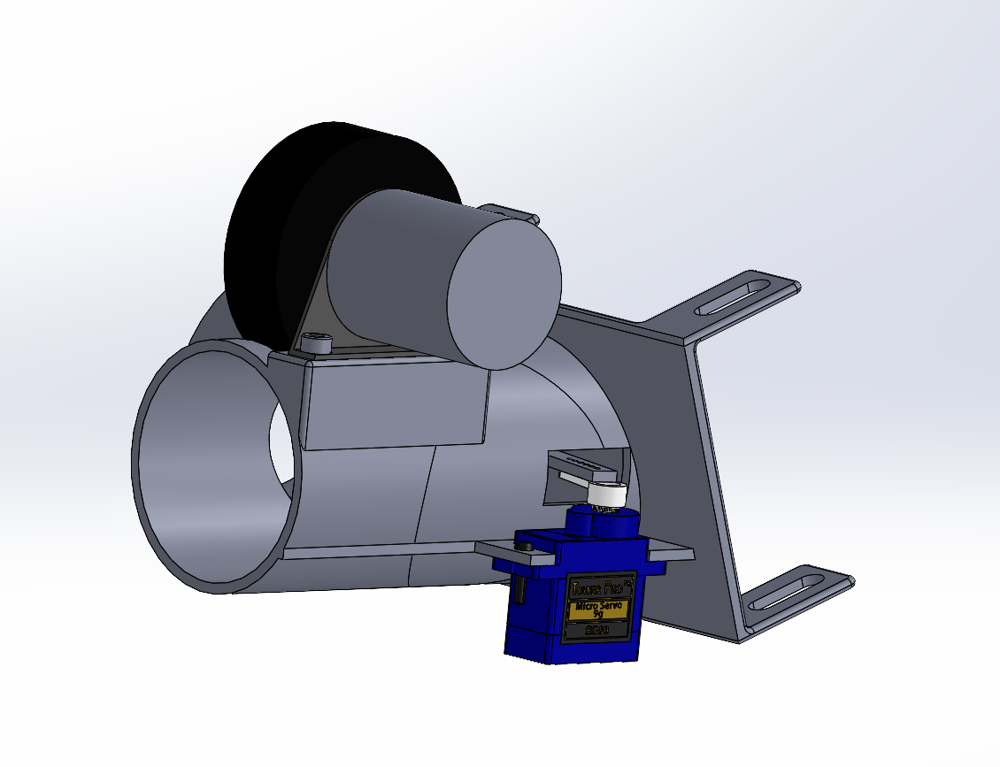
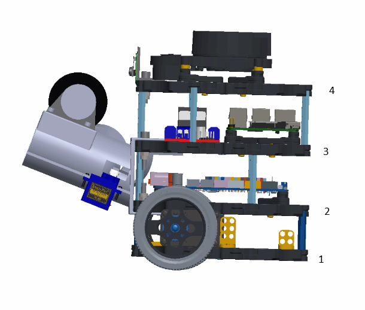

# Turtlebot Mechanical Documentation

## Problem description

For our mission, we are required to deposit **3 ping pong balls** each in the Stationary, Dynamic and Lift stations, with balls needing to be **deposited at specific intervals** at the Stationary station. Due to not knowing the distance at which our bot is from the stations (eg. due to obstacles, navigation restrictions), we have decided to **launch the balls** to deposit them in the stations.

### Overall design considerations
1. The bot must be able to store 9 ping pong balls, without dropping them during the run.
2. The launcher must be able to launch a ping pong ball minimally 40cm away. (Distance determined through discussion with the group, with reasonable doubt)
3. The launcher must be able to launch the balls one at a time, to allow for them to be deposited at specific intervals.
4. Any additions to the bot cannot block the Lidar sensor.
5. The footprint of the bot is to be minimised, to allow for easier navigation through the course and ensure fitment into the lift.

## Design Reasoning

Through activity M2 (where we researched possible mechanisms for launching), we were most inspired by this launcher design (https://www.youtube.com/watch?v=63ebX_zi2_c). Hence, we decided to use a **single flywheel launching system**, actuated by a **single servo motor pusher arm**, where the ping pong balls are **gravity-fed and stored in a tube, wrapped around the bot**.

Single flywheel system
- Single motor to remove points of failure due to a lower complexity
- A dual flywheel system might result in an inconsistent trajectory should motor control and the friction between the flywheels and the ping pong ball not be precise.
- Less complexity of parts and less weight

Servo pusher arm mechanism
- Acts as both a feed arm for the balls into the flywheels, as well as a stopper to prevent more than 1 ball from being fed at a time
- Provides the range of motion required without the complexity of cams or gears

Gravity-fed feeding
- Remove points of failure vs spring loading
- A flexible tube used to wrap around the Turtlebot to reduce bulk from a rigid tube
- Length of 9 ping pong balls: 9x40mm= 320mm > Height/Length of the bot, hence the tube is wrapped around the bot to achieve a smaller footprint, as the tube cannot be vertical to block the Lidar sensor or sideways to ensure fitment into the lift.

### Additional design Reasoning
1. A flexible hose was chosen for holding the ping pong balls as its flexibility allows for trial and error in terms of the angle and placement of the tube, alongside the flexibility of the placement of the mounting brackets, rather than a rigid tube or structure. This allows us to achieve a relatively small footprint compared to other teams.
2. A separate mount for the motor was chosen for added flexibility in tuning the amount of compression between the ping pong ball and the flywheel for the ideal launch behaviour for the mission.

Arm in loaded position

Arm in firing position

3. The mounting holes for the motor mount and barrel are slots, rather than holes. This allows for some flexibility in mounting and positioning to ensure full functionality of the bot.

## Procurement and manufacturing of components

After reviewing the fabrication methods through activity M4, we decided to proceed with **3D printing** for its ability to create complex shapes, especially our barrel with its geometry and mounting points for some of the sensors and actuators. Considering the load our parts will be under, the structural strength of FDM 3D-printed PLA parts are sufficent given the geometry and scale. Should cost be a concern after creating the Bill of Materials, we could also fabricate parts with manual fabrication methods. For example, the barrel could be cut from a PVC pipe and glued to an acrylic plate to achieve a similar geometry to our barrel.

We also decided to procure the tube, as a flexible tube would be difficult to manufacture with the provided tools. 

To determine the specification of the motor to procure, we performed some preliminary calculations.
We aim to determine what RPM a flywheel of radius 23mm would need to launch a ping pong ball 40cm at a 20 degree angle, with no starting and ending height of y=0cm, assuming 50% efficiency of energy transfer between the flywheel and the ball.

Hence, we chose the RS360 Motor as it has a no-load RPM of >10000, giving us more flexibility to fire from a greater distance if need be. It is also relatively cheap, and is a 12V motor, which is natively supported by our OpenCR.

## Turtlebot3 with Launcher Components

### Bill of Materials

### Printed Parts

Barrel

Flywheel

Motor Mount

Tube Support

Camera Mount

Pusher Arm

## Assembly Instruction
1. Before the firing assembly can be mounted on the turtlebot, the base Burger Turtlebot needs to be modified. 

- Shift the mounting points of the Raspberry Pi towards the rear and remount the Raspberry Pi.
- Shift the mounting points of the Lidar controller* just to the right of the Raspberry Pi and remount the Lidar controller.
- Install the motor driver just in front of the Raspberry Pi, making sure the motor output of the board faces the front of the robot.
- Add M3x20 brass spacers on the posts to extend the height of the layer.
- Add M2.5x20 brass spacers to the lidar to extend the height of the lidar. 

2. Assembly of firing assembly
- Install the motor to the motor mount.
- Install mastic tape on the flywheel and install it onto the motor, making sure to fuse the ends together as much as possible.
- Install the motor mount to the barrel.
- Install the servo pusher arm to the servo arm.
- Install the servo to the barrel, being careful to position the arm so that it does not hit the wall of the barrel.

Motor and mount

Motor Assembly

Barrel Assembly

3. Assemble the firing assembly to the Turtlebot
- Install the barrel assembly to Turtlebot, lining up the mounting tabs between layers 2 and 3.

Turtlebot Layers

4. Assembly of the tube
- Install the vacuum hose on the intake of the barrel and tighten the hose clamp.
- Wrap the hose around the turtlebot and note where the top of the hose is positioned.
- Install the first tube support at the top of the hose and secure the tube to the support with a cable tie.
- Install 2 additional tube supports to ensure the vacuum tube is properly secured and does not flop.
- Ensure functionality of the tube by ensuring that the ping pong balls roll down the tube and into the barrel.

### Important Installation Notes
1. When installing the motor to the barrel, use a ping pong ball as a guide. The ping pong ball should not be able to roll down the barrel when the motor-flywheel assembly is mounted. Add spacers between the motor mount and barrel as necessary to get the desired compression with the ping pong balls. From our testing, using an M4 nut as a spacer gave us the appropriate compression for our desired firing behaviour. 

2. Coat the solder joints of the motor to protect it from strain. In our case, we used hot glue.

3. Ensure all the cables are secured within the bot's footprint as much as possible, so that it does not drag on the ground, possibly get caught in the tires or get caught on the terrain of the course.
