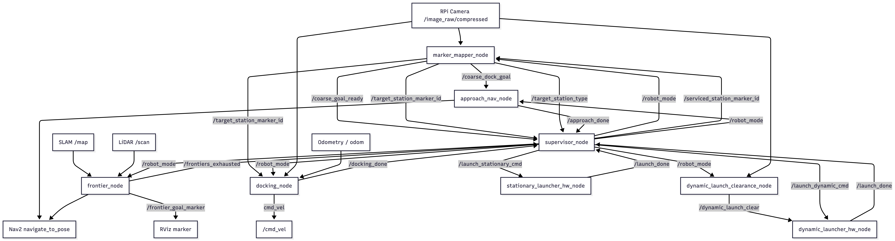

## Overall Software Architecture

Architecturally, the system follows a modular node-based design coordinated by a supervisor_node finite state machine. During exploration, frontier_node autonomously searches the map for reachable frontiers and sends goals through Nav2. In parallel, marker_mapper_node processes the camera feed to detect station ArUco markers and computes a coarse docking pose in the map frame. Once a station is selected, approach_nav_node sends that coarse goal to Nav2. After the robot reaches the staging point, docking_node takes over and performs final visual servoing using pose estimation and direct velocity commands. Once docking is complete, the supervisor triggers either the stationary or dynamic launcher hardware node. For the dynamic station, a separate dynamic_launch_clearance_node monitors the moving target and publishes launch-clearance signals whenever the dynamic marker re-enters full view. The overall ROS2 node architecture can be found below. It highlights all the topics along with their respective subscribers and publishers.

## ROS2 Node Architecture Diagram

## High Level Finite State Machine

The supervisor_node implements the main finite state machine of the robot and serves as the top-level mission coordinator. This FSM cleanly separates the mission into layers. Exploration, perception, approach, docking, and launching are all implemented by different nodes, while the supervisor acts as a central coordinator. That makes the system easier to debug and safer to control, because only the behaviour relevant to the current mission stage should be active at any time. 

It begins in EXPLORE mode, where the robot autonomously explores the environment while searching for station markers. Once a valid coarse goal is generated and the detected station type is identified, the FSM transitions into either APPROACH_STATIONARY or APPROACH_DYNAMIC. After successful coarse navigation, it proceeds into the corresponding docking state, where fine visual alignment is performed. Once docking is completed, the FSM triggers the appropriate launch sequence through either LAUNCH_STATIONARY or LAUNCH_DYNAMIC. After payload delivery is confirmed, the station is marked as serviced and the FSM resets to EXPLORE, allowing the robot to continue its mission. If exploration frontiers are exhausted before all required missions are completed, the FSM switches to ROAM as a fallback search mode.

## FSM States Table

## FSM States

| State | Purpose | What happens in this state | Exit condition | Next state |
|---|---|---|---|---|
| **EXPLORE** | Default mission state | The robot explores the map and keeps looking for station markers through the perception stack. The supervisor keeps publishing `/robot_mode = EXPLORE`. | A coarse docking goal becomes ready and the station type is known, or exploration frontiers are exhausted. | `APPROACH_STATIONARY`, `APPROACH_DYNAMIC`, or `ROAM` |
| **ROAM** | Backup searching mode after exploration finishes | This is entered when frontiers are exhausted but the mission is still not complete. It allows the system to keep reacting to detected stations even though formal frontier exploration has ended. | A coarse docking goal becomes ready for a detected station. | `APPROACH_STATIONARY` or `APPROACH_DYNAMIC` |
| **APPROACH_STATIONARY** | Coarse navigation to stationary station | The supervisor has identified a stationary target and waits for the approach node/Nav2 to finish moving the robot to the coarse pre-docking pose. | `/approach_done = True` | `DOCK_STATIONARY` |
| **APPROACH_DYNAMIC** | Coarse navigation to dynamic station | Same as above, but for the dynamic station. The robot navigates to the coarse pose associated with the dynamic target. | `/approach_done = True` | `DOCK_DYNAMIC` |
| **DOCK_STATIONARY** | Fine docking to stationary station | The docking node takes over and performs close-range visual alignment and motion until docking is complete. | `/docking_done = True` | `LAUNCH_STATIONARY` |
| **DOCK_DYNAMIC** | Fine docking to dynamic station | Similar to stationary docking, but used before timed launching at the dynamic station. | `/docking_done = True` | `LAUNCH_DYNAMIC` |
| **LAUNCH_STATIONARY** | Trigger stationary payload launch | The supervisor publishes `/launch_stationary_cmd = True` once when this mode begins, then waits for launch completion from the launcher node. | `/launch_done = True` | `EXPLORE` |
| **LAUNCH_DYNAMIC** | Trigger dynamic payload launch | The supervisor publishes `/launch_dynamic_cmd = True` once when this mode begins, then waits for launch completion from the dynamic launcher node. | `/launch_done = True` | `EXPLORE` |

