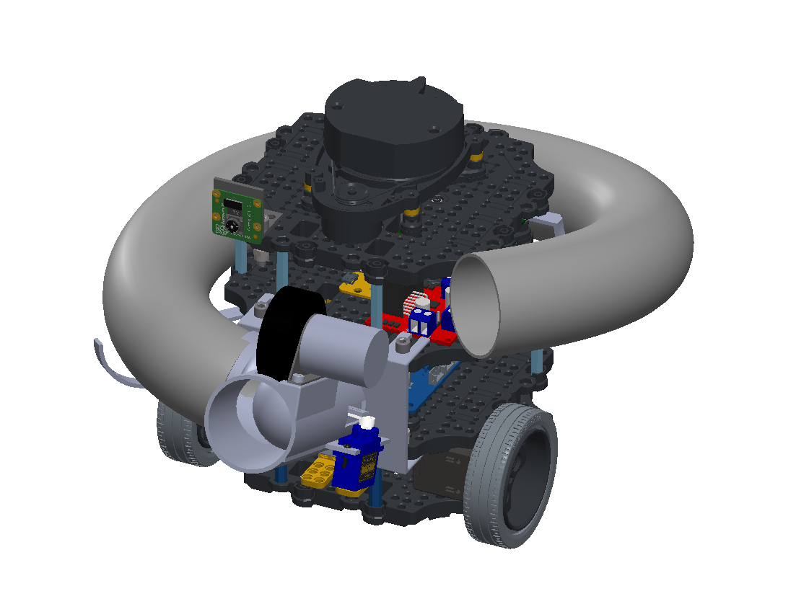
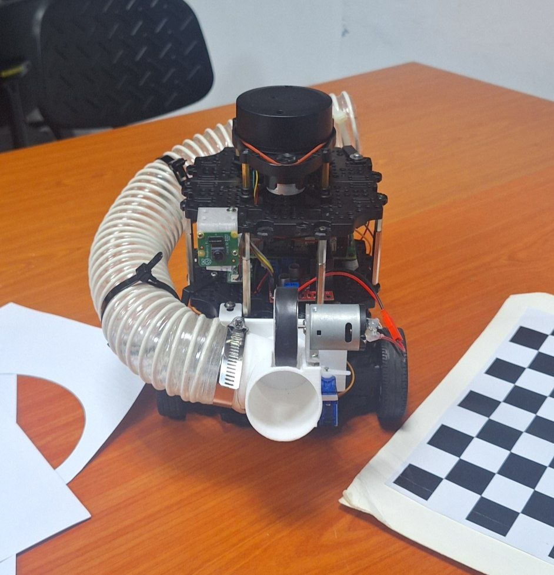

# CDE2310 - Autonomous Mobile Robots (AMRs) Intralogistics in a Smart Warehouse using a TurtleBot

> *National University of Singapore*  
> AY2025/2026 Semester 2 – **Group 9**

---

##  Team Members (Admin)

| Name                        | Matric Number   |
|-----------------------------|-----------------|
| Jitisha Arora               | A0336857M       |
| Xu Huanghao                 | A0306805H       |
| Low Zhiyang                 | A0299881A       |
| Khaizuran Bin Khalid        | A0273597L       |
| Jane Shallum                | A0330815L       |

---

##  Project Overview

This project designs and deploys an Autonomous Mobile Robot (AMR) to execute complex warehouse logistics. The system is a Turtlebot3 that can autonomously navigate an unknown environment, detect visual landmarks (AruCo markers), and execute precision payload deliveries without human intervention. Key Tasks:

Station A (Static Delivery): Detect static marker, dock, and dispense 3 balls in a specific timing
sequence.

Station B (Dynamic Delivery): Track a moving target (sliding rail), synchronize speed, and dispense the

**Key Features of our TurtleBot**:
- Autonomous SLAM navigation with ROS2
- Frontier-based maze exploration and Nav2 stack for navigation
- OpenCV (Pose Estimation) for AruCo marker detection and precise docking through a custom FSM and P-controller
- Custom-built Flywheel for delivering payload (balls)

### Final TurtleBot CAD Model

### Final TurtleBot Image

---

## Breakdown of repository

This repository contains:
- The full ros2 package to run our system + firmware for RPI [Link_to Steps_To_Run](Documentation/CLI_real_autonomous_system.md)
- Camera Calibration code [Link_to Steps_To_Run](Documentation/CLI_testing_system.md)
- Testing code for OpenCV and Gazebo [Link_to Steps_To_Run](Documentation/CLI_testing_system.md)
- Full technical documentation for this project [Link_to_Documentation_Breakdown](Documentation/README.md)

---

## Youtube Link to Screen Recording of Remote Desktop During Final Run

[Click_Here!](https://youtu.be/m-T_tzmzXRo?si=5tFvsvxTuXsTgGau)
